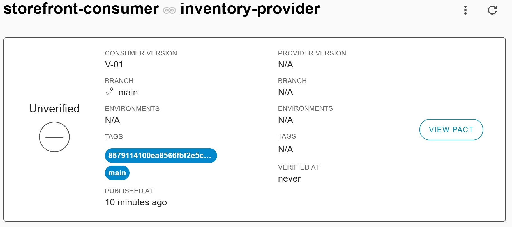

# CDCT Consumer Contract Testing
- https://docs.pact.io/implementation_guides/jvm/consumer/junit5
- https://docs.pact.io/implementation_guides/jvm/provider/junit5
- https://github.com/pact-foundation/pact-jvm/blob/master/consumer/junit5/src/test/groovy/au/com/dius/pact/consumer/junit5/MultiTest.groovy
- https://github.com/pact-foundation/pact-workshop-Maven-Springboot-JUnit5/tree/step11#step-11---using-a-pact-broker


## Project Structure
````css
cdct-rest-consumer-app/
├── src/main/java/com/arpan/consumer/
│   ├── CdctRestConsumerApplication.java
│   └── controller/
│       └── DataController.java
├── src/test/java/com/arpan/consumer/
│   ├── CdctRestConsumerApplicationTests.java
│   └── contract/
│       └── ConsumerContractTest.java
├── pom.xml
````

## Provider Endpoint & Response
Lets mock a providers API response, we are not consuming the whole response, instead we will consume a partial response
````shell
curl GET http://localhost:8080/api/products/P101 | python -m json.tool
````
````json
{
    "productId": "P101",
    "productName": "Product1",
    "price": 500,
    "productType": "DEFAULT",
    "version": "V-01",
    "active": true
}
````


## Step1. Setup Dependencies (Maven)

### [Pact Consumer Dependency:](https://mvnrepository.com/artifact/au.com.dius.pact.consumer/junit5)
````xml
    <!-- Pact Consumer Dependency -->
    <dependency>
      <groupId>au.com.dius.pact.consumer</groupId>
      <artifactId>junit5</artifactId>
      <version>4.6.5</version>
      <scope>test</scope>
    </dependency>

    <!--Optional: Pact Maven Plugin to upload the PACT to PactFlow-->
    <plugin>
      <groupId>au.com.dius.pact.provider</groupId>
      <artifactId>maven</artifactId>
      <version>4.1.11</version>
      <configuration>
        <pactBrokerUrl>https://arpangroup.pactflow.io/</pactBrokerUrl>
        <pactBrokerToken>0CSDSGVBGWMSDSDBCG</pactBrokerToken>
      </configuration>
    </plugin>
````


## Step2. Consumer Test (StoreFrontConsumerPactTest)
Now in our example (`StoreFrontConsumerPactTest`) we will consume only  `{productId, productName, price}`. We will ignore other fields during `PACT` creation.
````java
@PactConsumerTest // Step1
//@ExtendWith(PactConsumerTestExt.class) // Step1-alternative
//@PactTestFor(providerName = "inventory-provider", pactVersion = V4) // Step3-class level alternative when there is only one consumer test
class StoreFrontConsumerPactTest {

    @Pact(consumer = "ConsumerService") // Step2
    public V4Pact createStudentDetailsPact(PactDslWithProvider builder) throws Exception{
        // Define the expected response body using PactDslJsonBody
        /*PactDslJsonBody jsonBody = new PactDslJsonBody()
            .stringType("studentName", "John Doe")
            .stringType("studentId", "S12345")
            .integerType("age", 20);*/
        
        // Build the Pact interaction
       return builder
         // First interaction
            .given("State of a product with ID P101 is available in the inventory") // State
            .uponReceiving("StoreFrontConsumerPactTest interaction to fetch the details of product by ID P101") // Interaction
            .method("GET")
            .path("/api/products/P101")
            //.headers("Accept", "application/json")
            //.headers(Map.of("Content-Type", "application/json"))
         .willRespondWith()
            .status(200)
            //.matchHeader("Location", "http(s)?://\\w+:\\d+//some-service/user/\\w{36}$")
            //.body(LambdaDsl.newJsonBody((body) -> body.stringType("productId", "P123").stringType("productName", "Samsung Mobile").integerType("", 15000)).build())
            //.body(jsonStr)
            //.body(jsonBody, "application/json")
            .body(new PactDslJsonBody()
                    .stringType("productId", "P101")
                    .stringType("productName", "Samsung Mobile")
                    .integerType("price", 15000)
            )
         // Second interaction
         .given("State of a newly create order") //State
         .uponReceiving("StoreFrontConsumerPactTest interaction to create a new product") // Interaction
            .method("POST")
            .path("/api/products")
            .matchHeader(CONTENT_TYPE, APPLICATION_JSON, APPLICATION_JSON_CHARSET_UTF_8)
            .body(new ObjectMapper().writeValueAsString(productCreateRequest))
         .willRespondWith()
            .status(201)
            .headers(Map.of("Content-Type", "application/json"))
            .body(new ObjectMapper().writeValueAsString(expectedProductCreateResponse))
         .toPact(V4Pact.class);
    }

   @Test
   @PactTestFor(pactMethod = "createProductDetailsPact1", pactVersion = V4) // Step3: either on Test class, or on the Test method
   void testProductDetailsPact__for__StoreFront(MockServer mockServer) throws Exception {
      // Step1.1: or define expectedJson like:
      SimpleProductDto expectedProduct = new SimpleProductDto("P101", "Samsung Mobile", 15000);

      // Step2: define the actualJson response
      // In a consumer test, you need to use the mock server URL (provided by Pact)
      // instead of the actual external endpoint URL like (http://myapi.com/api/products/P123)
      // The purpose of a Pact consumer test is to validate the contract
      // using a simulated server rather than making real API
      ResponseEntity<SimpleProductDto> productResponse = new RestTemplate().getForEntity(mockServer.getUrl() + "/api/products/P101", SimpleProductDto.class);
      SimpleProductDto actualProduct = productResponse.getBody();

      // Step3: Validate the response
      assertThat(productResponse.getStatusCode().is2xxSuccessful()).isTrue();
      assertThat(productResponse.getStatusCode().value()).isEqualTo(200);

      // validate Headers
      assertThat(productResponse.getHeaders().getContentType().toString()).contains("application/json");

      // validate ResponseBody
      assertThat(actualProduct).usingRecursiveComparison().isEqualTo(expectedProduct);


      // Simulating the POST request & Validate the response
      ResponseEntity<SimpleProductDto> postResponse = new RestTemplate().postForEntity(mockServer.getUrl() + "/api/products", productCreateRequest, SimpleProductDto.class);
      assertThat(postResponse.getStatusCode().value()).isEqualTo(201);
      assertThat(postResponse.getBody()).usingRecursiveComparison().isEqualTo(expectedProductCreateResponse);
   }
}
````

### [Usage:](https://docs.pact.io/implementation_guides/jvm/consumer/junit5#usage)
- Step1: Add the `@PactConsumerTest` or `@ExtendWith(PactConsumerTestExt.class)` extension to the test class
- Step2: Create a method annotated with `@Pact` that returns the interactions for the test
- Step3: Link the mock server with the interactions for the test with `@PactTestFor`


<details>
<summary><span style="font-size: 18px; font-weight: bold; color: #5d65ff">Explanation:</span></summary>

1. **@ExtendWith:** ExtendWith is JUnit 5 annotation that is used to register extensions in JUnit tests. It facilitates the Pact features to the test class file to perform the contract testing
2. **@PactTestFor:** annotation is used to specify the provider against which the interactions defined in the test should be verified. The name below “student-provider” has to be mentioned the same as Provider and this binds the Provider and Consumer. <br/> You can either put this annotation on the test class, or on the test method
   1. **providerType = ProviderType.ASYNCH:**
   2. **pactVersion = PactSpecVersion.V4:**
   3. **port = 8081:** Ensure that the provider service is running on the correct port (80801in your case).
3. **V4Pact:** The createPact method returns `V4Pact` (others are `RequestResponsePact`, `RequestResponsePact`, `MessagePact`) as we defined `pactVersion = V4`
4. **.toPact(V4Pact.class):** This explicitly creates a `V4Pact` instance.
5. **@Pact:** annotation is used to mark the method that generates a Pact between the consumer and provider
6. **PactDslWithProvider:** object is automatically injected by Pact and it provides a fluent DSL for constructing a Pact between the consumer and provider.
   1. Other available Builders are: [PactBuilder](), [MessagePactBuilder]() <br/><br/>
7. **PactTestFor:** It indicates that this test is associated with the interactions defined in the above interactions (or Mock Response)
8. **MockServer:** object is automatically injected by Pact and it provides the URL where the mock server is running
   1. **setBaseURL:** Override the host URL so that the API request is redirected to the Pact mock server


### Here is an example of create pact using `PactBuilder`
````java
@Pact(provider = "ProviderService", consumer = "ConsumerService")
public V4Pact createPact(PactBuilder builder) {
    return builder
        .usingLegacyMessageDsl(false)
        .expectsToReceive("GET REQUEST")
        .withRequest(request -> request
                .path("/api/pact")
                .method("GET"))
        .willRespondWith(response -> response
                .status(200)
                .headers(Map.of("Content-Type", "application/json"))
                .body(new PactDslJsonBody()
                        .booleanType("condition", true)
                        .stringType("name", "tom")))
        .toPact();
  }
````

### Here is an example of create pact using `MessagePactBuilder`
````java
@Pact(consumer = "student-consumer")
public MessagePact studentDetailsPact(MessagePactBuilder builder) throws Exception {
  return builder
          .expectsToReceive("a student contract")
          //.withMetadata(Map.of("Content-Type", "application/json"))
          //.withContent(jsonBody)
          .withContent(content, "application/json")
          .toPact();
}
````


</details>


## Step3. Run the test cases:
````shell
mvn clean test -Dtest=StoreFrontConsumerPactTest,Test2
````
It will generate the pact files in the default directory (target/pacts)

[View the generated storefront-consumer-inventory-provider.json](images/storefront-consumer-inventory-provider.json)


## Step4. Publish contracts from Consumer [GitHub](https://github.com/pact-foundation/pact-workshop-Maven-Springboot-JUnit5/tree/step11#step-11---using-a-pact-broker)
Add the Pact maven plugin In consumer/pom.xml:
````xml
<!--Optional: Pact Maven Plugin is part of the Pact-JVM Maven Plugin 
for provider-side Pact testing and publishing Pact files to a Pact Broker-->
<plugin>
   <groupId>au.com.dius.pact.provider</groupId>
   <artifactId>maven</artifactId>
   <version>4.1.17</version>
   <executions>
      <execution>
         <id>publish-pacts</id>
         <phase>install</phase> <!-- Bind to the install phase -->
         <goals>
            <goal>publish</goal>
         </goals>
      </execution>
   </executions>
   <configuration>
      <pactDirectory>target/pacts</pactDirectory>
      <pactBrokerUrl>http://localhost:9292</pactBrokerUrl>
      <pactBrokerUsername>pact_workshop</pactBrokerUsername>
      <pactBrokerPassword>pact_workshop</pactBrokerPassword>
      <pactBrokerToken>${pact.broker.token}</pactBrokerToken>
      <pactBrokerAuthenticationScheme>Bearer</pactBrokerAuthenticationScheme>

      <projectVersion>V-01</projectVersion>
      <trimSnapshot>true</trimSnapshot>
      <skipPactPublish>false</skipPactPublish>
      <pact.verifier.publishResults>true</pact.verifier.publishResults>
      <tags>
         <tag>${git.branch}</tag> <!--first tag also automatically map to BRANCH on Pactflow UI -->
         <tag>${git.commit.id}</tag>
      </tags>
   </configuration>
</plugin>
````

And now we can run:
````shell
mvn pact:publish
or
./mvnw pact:publish -Dpact.publish.consumer.version=v01 -Dpact.publish.consumer.branchName=DEV
or
./mvnw pact:publish -Dpact.publish.consumer.version=$(git rev-parse HEAD) -Dpact.publish.consumer.branchName=$(git rev-parse --abbrev-ref HEAD)
[INFO] Scanning for projects...
[INFO] 
[INFO] -----------------< io.pact.workshop:product-catalogue >-----------------
[INFO] Building product-catalogue 0.0.1-SNAPSHOT
[INFO] --------------------------------[ jar ]---------------------------------
[INFO] 
[INFO] --- maven:4.1.17:publish (default-cli) @ product-catalogue ---
Publishing 'ProductCatalogue-ProductService.json' with tags 'prod, test' ... OK
[INFO] ------------------------------------------------------------------------
[INFO] BUILD SUCCESS
[INFO] ------------------------------------------------------------------------
[INFO] Total time:  0.745 s
[INFO] Finished at: 2021-03-01T09:51:29+11:00
[INFO] ------------------------------------------------------------------------
````




## Step5. Alternatively manually publish the pact file
Alternatively we can manually publish the pact file using the shell script as below:
````bash
./scripts/consumer_publish_pact.sh
````

<br/>

---
# Verify contracts on Provider
````java
@SpringBootTest(webEnvironment = SpringBootTest.WebEnvironment.RANDOM_PORT)
@Provider("ProductService")
@PactBroker // <--
public class PactVerificationTest {
  @LocalServerPort
  private int port;

  @Autowired
  private ProductRepository productRepository;

  @BeforeEach
  void setup(PactVerificationContext context) {
    context.setTarget(new HttpTestTarget("localhost", port));
  }

  @au.com.dius.pact.provider.junitsupport.loader.PactBrokerConsumerVersionSelectors
    public static SelectorBuilder consumerVersionSelectors() {
      // Select Pacts for consumers deployed or released to production, those on the main branch
      // and those on a named branch step11, for use in our workshop
      return new SelectorBuilder()
        .deployedOrReleased()
        .mainBranch()
        .branch("step11");
    }

  @TestTemplate
  @ExtendWith(PactVerificationSpringProvider.class) // <--
  void pactVerificationTestTemplate(PactVerificationContext context, HttpRequest request) {
    // WARNING: Do not modify anything else on the request, because you could invalidate the contract
    if (request.containsHeader("Authorization")) {
      request.setHeader("Authorization", "Bearer " + generateToken());
    }
    context.verifyInteraction();
  }

````
Let's run the provider verification one last time after this change:
````shell
provider ❯ ./mvnw verify -Dpact.verifier.publishResults=true -Dpact.provider.version=$(git rev-parse HEAD) -Dpact.provider.branch=$(git rev-parse --abbrev-ref HEAD)

<<< Omitted >>>

Verifying a pact between ProductCatalogue (41997003a6f42fe66ea00b234f05b47200474e49) and ProductService

  Notices:
    1) The pact at http://localhost:9292/pacts/provider/ProductService/consumer/ProductCatalogue/pact-version/5565ba9dfe81399a66afbebb620a3d79df43d46a is being verified because the pact content belongs to the consumer version matching the following criterion:
    * latest version from branch 'step11' (41997003a6f42fe66ea00b234f05b47200474e49)

  [from Pact Broker http://localhost:9292/pacts/provider/ProductService/consumer/ProductCatalogue/pact-version/5565ba9dfe81399a66afbebb620a3d79df43d46a/metadata/c1tdW2JdPXN0ZXAxMSZzW11bbF09dHJ1ZSZzW11bY3ZdPTE2]
  get all products with no auth token
2021-03-01 10:32:06.625  INFO 32791 --- [o-auto-1-exec-1] o.a.c.c.C.[Tomcat].[localhost].[/]       : Initializing Spring DispatcherServlet 'dispatcherServlet'
2021-03-01 10:32:06.625  INFO 32791 --- [o-auto-1-exec-1] o.s.web.servlet.DispatcherServlet        : Initializing Servlet 'dispatcherServlet'
2021-03-01 10:32:06.625  INFO 32791 --- [o-auto-1-exec-1] o.s.web.servlet.DispatcherServlet        : Completed initialization in 0 ms
    returns a response which
      has status code 401 (OK)
      has a matching body (OK)
      
<<< Omitted >>>

[INFO] 
[INFO] Results:
[INFO] 
[INFO] Tests run: 6, Failures: 0, Errors: 0, Skipped: 0
[INFO] 
[INFO] 
[INFO] --- maven-jar-plugin:3.3.0:jar (default-jar) @ product-service ---
[INFO] ------------------------------------------------------------------------
[INFO] BUILD SUCCESS
[INFO] ------------------------------------------------------------------------
````
As part of this process, the results of the verification - the outcome (boolean) and the detailed information about the failures at the interaction level - are published to the Broker also.

This is one of the Broker's more powerful features. Referred to as Verifications, it allows providers to report back the status of a verification to the broker. You'll get a quick view of the status of each consumer and provider on a nice dashboard. But it is much more important than this!


## Can I deploy?
````
consumer ❯ ./mvnw pact:can-i-deploy -Dpacticipant='ProductCatalogue' -DpacticipantVersion=$(git rev-parse HEAD) -DtoEnvironment=test
[INFO] Scanning for projects...
[INFO] 
[INFO] -----------------< io.pact.workshop:product-catalogue >-----------------
[INFO] Building product-catalogue 0.0.1-SNAPSHOT
[INFO] --------------------------------[ jar ]---------------------------------
[INFO] 
[INFO] --- maven:4.6.5:can-i-deploy (default-cli) @ product-catalogue ---
Computer says no ¯\_(ツ)_/¯ 

There is no verified pact between version 41997003a6f42fe66ea00b234f05b47200474e49 of ProductCatalogue and a version of ProductService currently in test (no version is currently recorded as deployed/released in this environment)
[INFO] ------------------------------------------------------------------------
[INFO] BUILD FAILURE
[INFO] ------------------------------------------------------------------------
[INFO] Total time:  0.611 s
[INFO] Finished at: 2024-01-30T16:16:20Z
[INFO] ------------------------------------------------------------------------

provider ❯ ./mvnw pact:can-i-deploy -Dpacticipant='ProductService' -DpacticipantVersion=$(git rev-parse HEAD) -DtoEnvironment=test
[INFO] Scanning for projects...
[INFO] 
[INFO] ------------------< io.pact.workshop:product-service >------------------
[INFO] Building product-service 1.0-SNAPSHOT
[INFO] --------------------------------[ jar ]---------------------------------
[INFO] 
[INFO] --- maven:4.1.17:can-i-deploy (default-cli) @ product-service ---
Computer says yes \o/ 

All required verification results are published and successful
[INFO] ------------------------------------------------------------------------
[INFO] BUILD SUCCESS
[INFO] ------------------------------------------------------------------------
````
